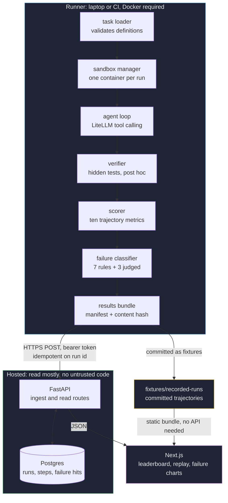

# Architecture

## The decision that shapes everything else

Evaluation compute and results storage are separate systems, deliberately.

Running an agent needs a Docker daemon, arbitrary CPU, and the ability to execute
untrusted model-generated shell commands. No free hosting platform will give you those
three things together, and none should. So the runner executes where Docker is available,
which is a laptop or a CI job, produces a results bundle with a content hash over every
run, and pushes it to a small hosted API that stores it in Postgres and serves it to a web
app.

That is not a workaround for a hosting constraint. It is how evaluation infrastructure
wants to be built regardless, because the two halves have opposite requirements:

|                     | Evaluation compute      | Results storage        |
| ------------------- | ----------------------- | ---------------------- |
| Lifetime            | Ephemeral, per run      | Durable, forever       |
| Scaling             | Elastic, bursty         | Flat, read mostly      |
| Trust               | Runs untrusted code     | Runs nothing untrusted |
| Failure consequence | Retry the run           | Lose the results       |
| Cost driver         | CPU minutes and tokens  | Bytes stored           |

Coupling them means either paying for idle evaluation capacity or accepting that your
results disappear when the evaluation box does. Splitting them means a results bundle is a
portable artefact: the same bundle can be produced on a laptop, replayed from a file,
pushed to a service, or committed to a repository as a fixture. This repository does all
four.

```
                        ┌─────────────────────────────────────┐
  LOCAL OR CI           │  RUNNER                             │
  (Docker available)    │                                     │
                        │  task loader                        │
                        │      v                              │
                        │  sandbox manager (Docker SDK)       │
                        │      v                              │
                        │  agent loop (LiteLLM, tool calls)   │
                        │      v                              │
                        │  verifier (hidden tests, post hoc)  │
                        │      v                              │
                        │  scorer (10 trajectory metrics)     │
                        │      v                              │
                        │  failure classifier (rules + judge) │
                        │      v                              │
                        │  results bundle (JSON + manifest)   │
                        └──────────────┬──────────────────────┘
                                       │  HTTPS POST, API key
                                       v
                        ┌─────────────────────────────────────┐
  FLY.IO FREE           │  API (FastAPI)                      │
                        │  ingest, leaderboard, runs,         │
                        │  trajectories, failure modes        │
                        └──────────────┬──────────────────────┘
                                       │
                                       v
                        ┌─────────────────────────────────────┐
  NEON FREE             │  POSTGRES                           │
                        │  tasks, runs, steps, failure hits   │
                        └──────────────┬──────────────────────┘
                                       │
                                       v
                        ┌─────────────────────────────────────┐
  VERCEL OR PAGES       │  WEB (Next.js)                      │
                        │  leaderboard, task detail,          │
                        │  trajectory replay, failure charts  │
                        └─────────────────────────────────────┘
```



The web app has two data sources and one shape. With `NEXT_PUBLIC_API_URL` set it reads
the live API; without it, the committed fixture bundle. Both serve the identical Pydantic
models, so the client cannot tell which one it is talking to. That is what makes the public
demo work for a stranger with no key and nothing to configure, and it is also why the
demo does not go dark when the API scales to zero.

## Packages

```
packages/core     trajectory_core    schemas, scoring, taxonomy, judge, aggregation
packages/runner   trajectory_runner  sandbox, agent loop, verifier, CLI, upload
packages/api      trajectory_api     the results service
web/                                 the leaderboard and replay viewer
```

`core` holds the contract and every pure function over it. `runner` is the only package
that executes anything. `api` is the only package that talks to a database. Nothing in
`core` imports either of the others, which is what lets a run record be rescored by a
process that has no Docker and no Postgres.

## The property the whole benchmark rests on

The hidden tests are not present in the filesystem while the agent is running.

`verify/` is never copied into the task image, and validation rejects a Dockerfile that
tries. It is copied into the running container only after the agent loop has ended, by the
verifier. There is a test that searches the entire container filesystem during the agent
phase and asserts the test file is not there.

An agent that can read the verification tests will read them, and the benchmark is
worthless from the first time that happens quietly. Every other design choice here is
negotiable; this one is not.

## Why these dependencies

**LiteLLM.** A harness that can only evaluate one vendor's models is not a harness, it is
a report card. Anthropic, OpenAI, Google and a local Ollama server all arrive through one
call with no branching anywhere else in the codebase. The cost of that is one heavyweight
dependency, imported lazily so an offline run never touches it.

**Pydantic v2 at every boundary.** Trajectory records are the product. A malformed record
discovered three days after an expensive evaluation run is far worse than a validation
error raised at the moment it was written. Unknown fields are rejected rather than dropped,
so a bundle from a newer harness fails loudly on ingest instead of silently losing the
fields this version does not understand.

**Typer with Rich.** The CLI is how an engineer actually uses this, which makes it worth
polishing rather than the last thing built. A good CLI is the difference between a
repository someone clones and one they keep.

**Docker SDK rather than a custom runtime.** Containers are a solved problem. Writing a
sandbox would be a second project with worse isolation.

**SQLModel over Postgres.** JSONB for the parts that are genuinely documents (tool
arguments, workspace manifests, fingerprints), columns for the parts that are queried.
Timestamps are `TIMESTAMP WITH TIME ZONE`, because the default naive type silently drops
the offset and turns a reproducible record into an ambiguous one.

## Storage shape

Run summaries are columns, because every leaderboard and task query filters and sorts on
them. Steps and failure hits are rows, because the trajectory endpoint paginates and the
failures endpoint groups by mode.

Aggregation happens in Python, in `trajectory_core.aggregate`, not in SQL. That is
deliberate and worth defending: the CLI's report and the hosted leaderboard have to produce
identical numbers, and the only way to guarantee that is for both to call the same
function. Two SQL views and one Python implementation agree right up until they do not,
and the failure is a published number nobody can reproduce. At this scale the query cost
is irrelevant. There is a test asserting the served leaderboard matches what the core
aggregation computes, and the seam for moving it into SQL later is one function in
`queries.py`.

## Two sandbox backends

`DockerSandbox` is the production backend. One container per run, non-root, memory and CPU
and PID ceilings, all capabilities dropped, no-new-privileges, network off unless the task
justifies it in writing, tmpfs for scratch, removed on exit including when the body raises.

`LocalSandbox` runs commands in a temporary directory on the host. It exists because task
authoring should not require a Docker daemon, and because CI for the pure-Python parts
should not need to pull images. It is a convenience with a seatbelt, not an isolation
boundary, and it is honest about that in three ways: it refuses to start without an
explicit environment variable, it blocks commands that reach at obvious host paths, and it
stamps `sandbox_backend=local` on every run it produces.

That stamp is part of a leaderboard row's identity, not a footnote. Local runs form their
own rows and are never averaged together with container runs, because that backend cannot
promise the agent never read the hidden tests: the host filesystem is visible, so the tests
are reachable by absolute path even though the file tools refuse to leave the workspace.
Labelling is the honest option. Hiding them would leave a demo with nothing in it, and
merging them would publish a number nobody could defend.

## Reproducibility

Every run record carries:

- `harness_version` and `schema_version`
- `runner_fingerprint`: OS, release, architecture, Python version, CPU count, Docker
  server version, sandbox backend, whether it was CI
- `image_id`, the content address of the image the run executed in
- `config`: model, temperature, seed, step ceiling, timeouts, output cap, budget
- `initial_workspace` and `final_workspace`, a content hash of every file before and after

`image_id` earns its place. A version tag in a Dockerfile can move under you; a content
address cannot. When a published number shifts, that field is what answers "did the model
change or did the environment" without guessing.

The workspace manifests are there because two failure mode rules need them: path
hallucination compares the paths an agent referenced against the paths that actually
existed, and scope creep compares what changed against what the task said it was about.
Keeping them in the run record rather than in a side file means rescoring a run a month
later needs nothing but the run.

## Crash behaviour

Steps are appended to a JSON lines file and flushed as they complete, before the next model
call. A run that dies at step 38 leaves 38 usable steps on disk. When the run seals, the
partial file is deleted, so a leftover partial file after a suite finishes is a signal that
a run crashed rather than litter: the CLI reports it and the report says how many steps
survived.

Losing an afternoon of provider spend to a process that died with everything in memory is
a self-inflicted wound, and so is a suite that quietly reports eleven tasks because the
twelfth crashed.

## What is deliberately absent

**No user accounts, no OAuth, no sessions.** Reads are public because the point of the
project is that a stranger can look at the results. Writes take a bearer token, which is
enough for a service whose writers are a laptop and a CI job.

**No job queue, no Celery, no Redis.** The CLI with a thread pool is correct at this scale.
The work is almost entirely waiting on a container or an HTTP call, threads keep the shared
spend ledger honest with no inter-process plumbing, and a queue would be infrastructure
that exists to look serious.

**No caching layer.** The reads are cheap and the data changes when someone runs an
evaluation.

**No second API machine.** One machine means the in-process rate limiter is correct rather
than approximately correct.

Each of those is a thing that could be added in an afternoon if a real constraint appeared.
None of them has one yet.
