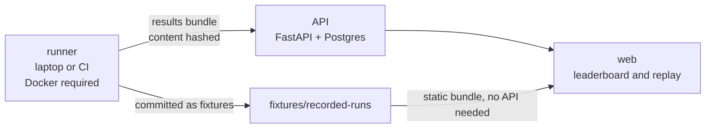

# trajectory

Evaluation harness for coding agents. Runs agents against containerized tasks with hidden
tests, and scores the trajectory, not just the outcome.

[](https://github.com/mekala27-45/trajectory/actions/workflows/ci.yml)
[](https://github.com/mekala27-45/trajectory/actions/workflows/pages.yml)
[](https://pypi.org/project/trajectory-eval/)
[](https://pypi.org/project/trajectory-eval/)
[](LICENSE)


**Live leaderboard:** https://mekala27-45.github.io/trajectory/ &nbsp; **Metrics:**
[docs/metrics.md](docs/metrics.md) &nbsp; **Results:** [RESULTS.md](RESULTS.md)

## Where to start

Four links, in the order that makes the rest of this readable. No install needed for any of
them.

1. **[Replay a real run](https://mekala27-45.github.io/trajectory/)**, on the live
   leaderboard. Click any row, then any step. That step by step record is the thing this
   project exists to produce, and seeing one is faster than reading about one.
2. **[The three findings](RESULTS.md#three-findings)**. Three agents tied at 100 percent and
   what separated them, a pass rate that could have been published as anything from 0 to 50,
   and a failure whose cause sits eight steps earlier in the trajectory.
3. **[What gets measured](docs/metrics.md)**, if you want the formulas rather than the prose.
   Ten metrics, each a pure function of the run record, which is why a metric added later can
   be applied to results published earlier.
4. **[Limitations](#limitations)**. Read before quoting anything above. The published matrix
   comes from scripted offline policies rather than language models, and it ran on the
   unisolated sandbox. Both are stated in full, and both are one command away from being
   fixed by anyone who clones this.

## Why

A model team improving a coding agent gets a pass rate of 41 percent. They ship a change.
It becomes 43 percent. They have no idea what changed. Did the agent get better at
recovering from a failed command, or did it get luckier on three tasks? Did the new system
prompt fix the shell quoting problem, or introduce a new tendency to claim success before
running the tests?

Aggregate pass rate hides all of that. Trajectory-level metrics do not. This harness exists
to make agent failures legible.

The published matrix shows the problem directly. Three of the five agents scored **100.0%
+/- 0.0%**, identical rows on any conventional leaderboard. One of them made a malformed
tool call on every single run. Another repeated roughly half of every command it issued.
Six failure modes fired 213 times on runs that passed every hidden test, on 106 of the 155
solved runs, and a failure table scoped to failures shows none of them.

## Results

| model | solve rate | step efficiency | tool validity | redundancy | recovery |
| --- | --- | --- | --- | --- | --- |
| `stub:methodical` | 100.0% +/- 0.0% | 1.000 | 1.000 | 0.062 | 1.000 |
| `stub:sloppy` | 100.0% +/- 0.0% | 0.766 | **0.922** | 0.052 | 1.000 |
| `stub:thrasher` | 100.0% +/- 0.0% | **0.664** | 1.000 | **0.493** | **0.833 +/- 0.136** |
| `stub:reckless` | 97.2% +/- 3.9% | 0.766 | 1.000 | 0.045 | 1.000 |
| `stub:hasty` | **33.3% +/- 23.6%** | 1.000 | 1.000 | 0.014 | 1.000 |

180 runs, 12 tasks, 3 seeds, 47.9 minutes, 0.00 USD.

Step efficiency is scored only on runs that solved the task, so `stub:hasty` reaching
1.000 is not a contradiction: on the third of runs where quitting early happened to be
enough, it used no more steps than the reference route. Scoring efficiency on a failed
run would reward giving up, which is the behaviour this policy exists to exhibit.

These five are **scripted offline policies, not language models**, and this matrix ran on
an unisolated sandbox. Both are stated in full in [RESULTS.md](RESULTS.md), along with
three written findings and a limitations section that is worth more than the table. Read
that before quoting any of this.

## Quickstart

```bash
pip install trajectory-eval

# offline, no key, no spend: a scripted policy against one task
trajectory run --task py-failing-suite-01 --model stub:methodical
trajectory replay <run-id>

# with a real model
export ANTHROPIC_API_KEY=...
trajectory run --suite core-12 --model anthropic/<model> \
  --seed 0 --seed 1 --seed 2 --parallel 4 --budget-usd 10.00
trajectory report --format md
```

`--budget-usd` is a hard ceiling checked before every model call and shared across parallel
runs. Any model LiteLLM can reach works, including a local Ollama server, with no code
change.

From a checkout, `make install` then `make check`. If you have no `make`, which includes a
default Windows install, [CONTRIBUTING.md](CONTRIBUTING.md#without-make) lists the direct
`uv run` equivalent of every target.

## What gets measured

Ten metrics per run, each a pure function of the run record, so a metric added later can be
applied to results published earlier. Full formulas in [docs/metrics.md](docs/metrics.md).

| | metric | what it catches |
| --- | --- | --- |
| 1 | solved | the hidden tests passed |
| 2 | partial credit | four failing tests taken down to one is progress |
| 3 | step efficiency | reference steps over steps taken, null on failures |
| 4 | tool call validity | malformed and invented tool calls |
| 5 | redundant action rate | byte-identical repeat commands |
| 6 | recovery rate | did it adapt after a failure, or just retry |
| 7 | premature termination | called finish while the tests were still red |
| 8 | context drift | did the last third stay on task (judged) |
| 9 | cost and wall clock | spend per solved task, not per call |
| 10 | destructive attempts | `git reset --hard` before looking at anything |

Every leaderboard cell carries a standard deviation across seeds. A pass rate without its
spread is not a result: one policy here reads 33.3% +/- 23.6%, and a single-seed run of it
would have published either 0% or 50%.

## Failure modes

Ten named modes applied to every run. Seven decided by deterministic rules, three by a
rubric judge whose self-agreement is measured and published.

| id | mode | how |
| --- | --- | --- |
| F01 | tool schema violation | rule |
| F02 | path hallucination | rule, against a workspace listing taken before step 0 |
| F03 | premature success | rule |
| F04 | retry loop | rule |
| F05 | shell quoting error | rule |
| F06 | ignored test output | judge |
| F07 | long horizon context loss | judge |
| F08 | destructive action | rule |
| F09 | scope creep | rule, against a workspace diff |
| F10 | environment mismatch | judge |

Counts are reported over two populations: unsolved runs, which is the triage view, and
**solved runs**, which is the view no pass rate can produce. A run that made three
malformed calls, invented two paths and got the tests green anyway is a process problem
that succeeded.

Browse them on the [live failures page](https://mekala27-45.github.io/trajectory/failures).

## The suite

Twelve tasks, four languages, difficulty 1 to 5. Each ships a Dockerfile, a workspace, a
set of hidden tests the agent never sees, and a reference solution that CI replays against
those tests on every push.

| id | lang | tier | what breaks |
| --- | --- | --- | --- |
| `py-failing-suite-01` | py | 1 | one off by one in an inclusive date range |
| `py-dep-conflict-01` | py | 2 | two plugins pinned against incompatible majors |
| `ts-build-break-01` | ts | 2 | a project reference build, with strict mode as the trap |
| `log-forensics-01` | any | 2 | one config change in 40,000 log lines, three distractions |
| `py-flaky-test-01` | py | 3 | unseeded randomness, failing about three runs in ten |
| `py-perf-01` | py | 3 | accidentally quadratic, 12.0 s against a 2.0 s budget |
| `py-etl-schema-01` | py | 3 | upstream renamed, split and reformatted its columns |
| `cli-implement-01` | py | 3 | a written specification and no visible tests at all |
| `ts-api-contract-01` | ts | 3 | a generated client that drifted, with a hand edit on top |
| `go-race-01` | go | 4 | a data race that one big mutex "fixes" and fails |
| `sql-migration-01` | sql | 4 | a migration that is correct and unsafe to run |
| `git-surgery-01` | any | 5 | a commit dropped by a rebase, reflogs expired |

Every task has a plausible wrong fix that the hidden tests reject, named in its
description. That is what separates a task that measures engineering from one that measures
typing. `ts-api-contract-01` is the clearest: repairing the symptom builds green and scores
4 of 9.

## Architecture

Evaluation compute and results storage are separate systems.

Running an agent needs Docker, arbitrary CPU, and the ability to execute untrusted
model-generated shell commands. So the runner executes where Docker is available, a laptop
or a CI job, produces a signed results bundle, and pushes it to a small hosted API that
stores it in Postgres and serves it to the web app.

That is not a workaround for a hosting constraint. Evaluation compute wants to be elastic
and ephemeral; results want to be durable and queryable. Coupling them means either paying
for idle capacity or losing your results when the box goes away.



The one property everything rests on: **the hidden tests are not in the filesystem while
the agent is running.** They are copied in only after the agent stops, task validation
rejects a Dockerfile that bakes them into the image, and there is a test that searches the
whole container filesystem during the agent phase and asserts they are not there.

Full detail, including the storage shape and what is deliberately absent, in
[ARCHITECTURE.md](ARCHITECTURE.md).

## Writing your own tasks

```bash
trajectory tasks new my-task-01 --difficulty 3 --language python
trajectory tasks validate --strict
trajectory tasks verify-references --task my-task-01
```

The second command asserts that the unfixed workspace **fails** its hidden tests and that
the reference playbook drives it to passing. A task that starts green is scored by every
agent and measures nothing; a task whose own reference solution has rotted can be scored by
none. Both happen in real benchmarks and both quietly move the suite average.

[docs/writing-tasks.md](docs/writing-tasks.md) is the full guide.

## Limitations

Not buried, because they decide whether the rest is worth reading.

- **Twelve tasks is twelve tasks.** Not comprehensive, not state of the art, not the first
  of anything. Solve rates on twelve tasks have wide confidence intervals however many
  seeds you run.
- **One person wrote every task**, so the suite carries that person's biases about what is
  hard. Nothing here covers reading an unfamiliar large codebase, or API design, or
  anything a front-end engineer would recognise as their job.
- **The published matrix is scripted policies, not models.** It validates the harness. It
  says nothing about any language model.
- **The published matrix ran on the unisolated sandbox**, because the authoring machine had
  no Docker daemon. Every row is labelled `local` and never averaged with container rows.
  Twenty five minutes on a machine with Docker fixes it, with no code change.
- **Judge self-agreement is unmeasured**, because no model key was available. Metric 8 is
  null on all 180 runs and the three judged modes were never applied. Their zeros mean "not
  measured".
- **Step efficiency divides by a reference solution one person wrote**, which may not be
  optimal. Read it as a ratio against one competent route.
- **Redundant action rate has a floor above zero**, 0.062 on this suite, because re-running
  the tests after a fix is a repeat command and the right thing to do.

[RESULTS.md](RESULTS.md) states each of these with the specific number affected.

## Licence and independence

Apache 2.0. See [LICENSE](LICENSE).

Independent work, built from scratch against public tooling and public data. No employer
code, data, system names or screenshots. Every task in the suite was written for this
repository.

## Who built this

[Ajay Mekala](https://linkedin.com/in/ajaymekala). AI/ML Engineer, production ML platforms
and MLOps, with four years of frontier model evaluation on contract alongside it: agent
trajectory scoring, benchmark task authoring, rubric design.

That contract work is covered by NDA, which is the reason this repository exists. It applies
the same methodology to tasks written from scratch, in public, where the numbers can be
checked rather than taken on trust.

[Portfolio](https://mekala27-45.github.io) &nbsp; [GitHub](https://github.com/mekala27-45)
&nbsp; mekalaajayk@gmail.com

Open to AI/ML Engineer, Machine Learning Engineer and model evaluation roles. Questions about
the design are welcome as issues.
